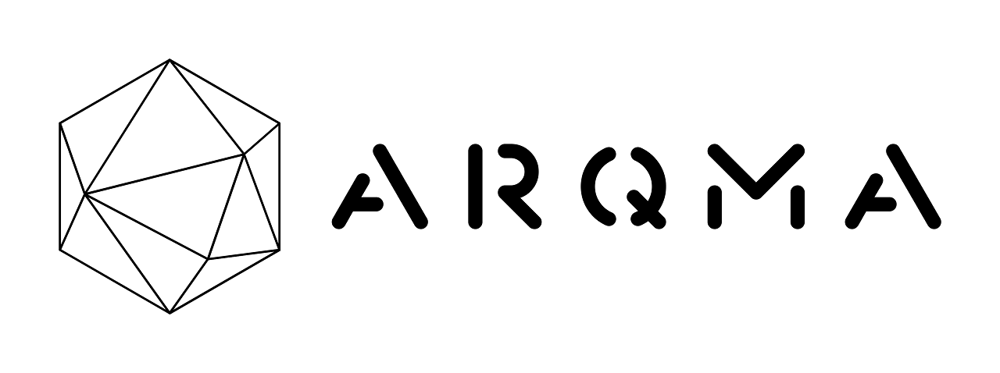

## A guide for the ArQmA GUI wallet

This repository contains the guide for the [ArQmA GUI Wallet](https://github.com/arqma/arqma.github.io -TBD).
This document is meant to be updated continuously and **a new major release will be available whenever ArQmA publishes a new version of the GUI**.
&nbsp;

The guide is composed by several different markdown files (see the chapter 'structure'). For simplicity, we have an easy-to-consult version:
&nbsp;

**[ArQmA-GUI-guide.md](https://github.com/arqma/arqma.github.io/ArQmA-GUI-guide/blob/master/ArQmA-GUI-guide.md)**

### Versions and branches
The links above are for the **upstream version of the guide**. In other words, they are synced with the *master* branch of the ArQmA GUI wallet.
&nbsp;

If you are looking for the guide for a specific GUI release, change the branch of this repository.  
Branches available:

+ **(https://github.com/arqma/arqma.github.io/ArQmA-GUI-guide/tree/)**: ArQmA GUI Devil's Cauldron 0.3.2.1


For **PDF** and **EPUB** versions, check out the [latest Release](https://github.com/arqma/arqma.github.io/ArQmA-GUI-guide/releases).

## Structure and guidelines for contributors
The original guide can be found in the [en](https://github.com/arqma/arqma.github.io/ArQmA-GUI-guide/blob/master/en) folder. It's divided in 11 main chapters:

**Chapter**|**Content**
---|--- 
00 | [Preface](https://github.com/mechanator/ArQmA-GUI-wallet-guide/blob/master/en/ch00.md)
01 | [Welcome](https://github.com/mechanator/ArQmA-GUI-wallet-guide/blob/master/en/ch01.md)
02 | [Create a Wallet](https://github.com/mechanator/ArQmA-GUI-wallet-guide/blob/master/en/ch02.md)
03 | [ArQmA Account](https://github.com/mechanator/ArQmA-GUI-wallet-guide/blob/master/en/ch03.md)
04 | [Send ArQmA](https://github.com/mechanator/ArQmA-GUI-wallet-guide/blob/master/en/ch04.md)
05 | [Receive ArQmA](https://github.com/mechanator/ArQmA-GUI-wallet-guide/blob/master/en/ch05.md)
06 | [Transaction History](https://github.com/mechanator/ArQmA-GUI-wallet-guide/blob/master/en/ch06.md)
07 | [Advanced Features](https://github.com/mechanator/ArQmA-GUI-wallet-guide/blob/master/en/ch07.md)
08 | [Settings](https://github.com/mechanator/ArQmA-GUI-wallet-guide/blob/master/en/ch08.md)
09 | [Binaries Verification](https://github.com/mechanator/ArQmA-GUI-wallet-guide/blob/master/en/ch09.md)
10 | [About Remote Nodes](https://github.com/mechanator/ArQmA-GUI-wallet-guide/blob/master/en/ch10.md)
11 | [Common Issues and Solutions](https://github.com/mechanator/ArQmA-GUI-wallet-guide/blob/master/en/ch11.md)

These single chapters can be built in a single file in 3 different formats: **HTML**, **PDF** and **EPUB**.  
To do so we use pandoc. If you wish to **build the guide by yourself**, you can do it following these steps (on Linux):

1. Download Pandoc and all necessary dependencies:
```
sudo apt install pandoc
sudo apt install texlive texlive-xetex texlive-latex-extra
```

2. From the source of the repository run:
```
make [format][-language]
```
For example, if you wish to build only the Spanish version in PDF format, you should run `make pdf-es`.  
If you want all languages in a single format: `make epub`- This will give you the epub version in all languages.  
If you want to build all formats for all available languages: `make all` - This will build the guide in PDF, HTML and EPUB in all available languages.

### Contribute!
Improvements are always welcome. Feel free to propose a change using the issue tracker or opening a pull request.  
If you wish to contribute, please **do not** edit the file *ArQmA-GUI-guide.md*. That's just temporary and it gets built manually. Work ONLY on the *.md* files inside the 'en' folder. Every pull request with changes to *monero-GUI-guide.md* will be rejected.

## Translations
Before adding a translation, please keep in mind the general guidelines for ArQmA translators, which are:

- **Avoid** the use of **gender specific** terminology.
- If available, use the **glossary** for your language. This will help to keep translations consistent across different works. You can find all glossaries [here](https://github.com/mechanator/ArQmA-GUI-wallet-guide/tree/master/terminology-guides).
- Read the guide '[Translation tips for ArQmA translators](https://github.com/mechanator/ArQmA-GUI-wallet-guide/tree/master/arqma-translations/translation-tips.md)'. **It contains all the information you need** to submit a perfect translation.
- If a string contains numbers, just keep them as they are.

### Steps
Adding a translation is very easy:

1. Copy the *en* folder with all its content (including the 'makefile') and rename the new folder with the codename of your language (for example */it* for Italian).
2. Translate all the text you find, except for code and html.
3. Edit the string `LANGUAGES =` in the main makefile, after 'en' (or the previous added language) add the name of the folder which contains your translations.
4. Push the changes to your local branch and open a pull request.

**Do not edit** the files contained in the /translations folder. They are manually built. All changes MUST be done on the appropriate source folder (/en for English, /es for Spanish, etc..).

### Support
If you need **help/support**, open an issue on this repository or contact ArqTras. You can do so:
  
+ On chat Telegram or Discord. Links on the main arqma.com site.
Discord: https://discord.gg/TqXZWGm

Telegram: https://t.me/joinchat/HNpOMRIiNSoCn0zYrAOofw

+ On **reddit**: just PM /r/arqma/ArqTras

### As submissions and editing occurs, the final version will be reviewed and edited accordingly by the community.
